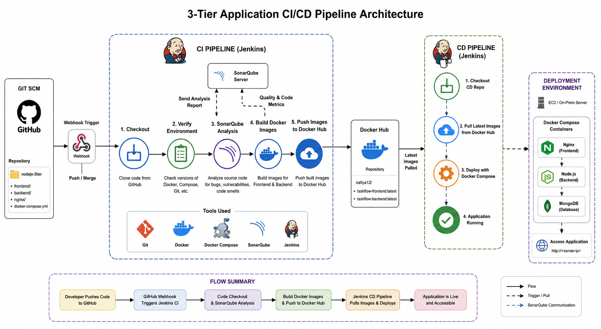
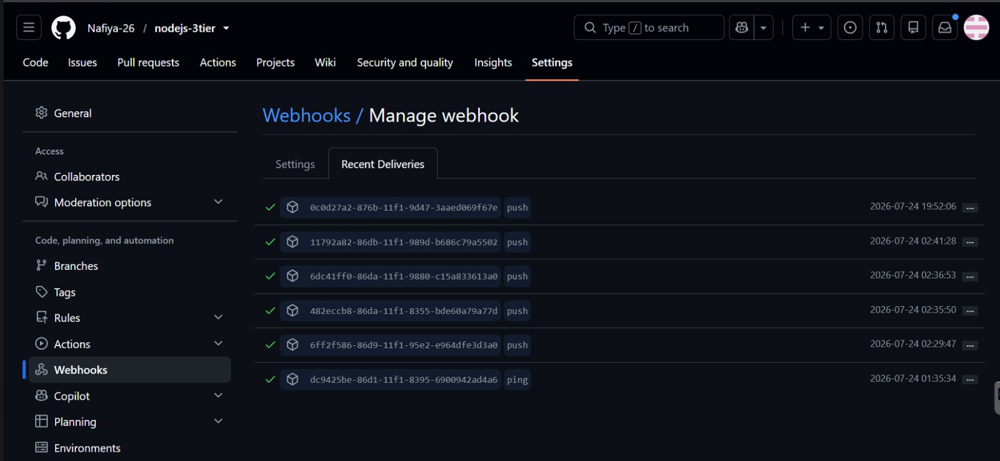
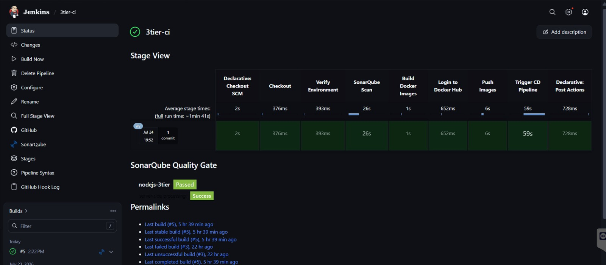
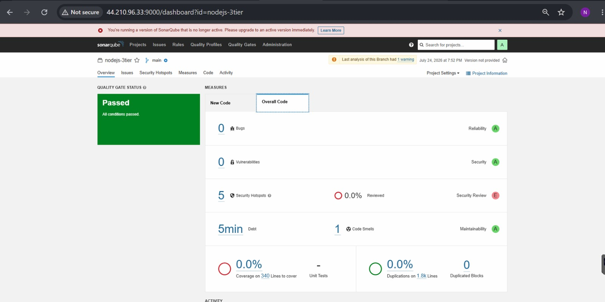
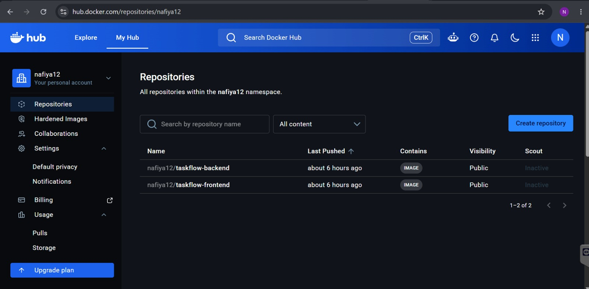
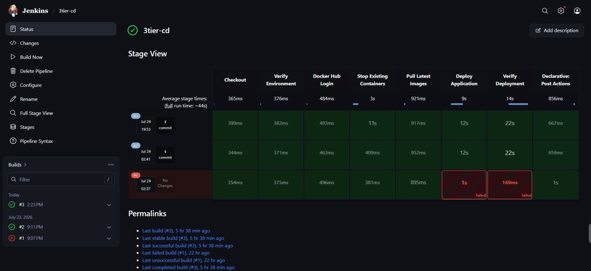
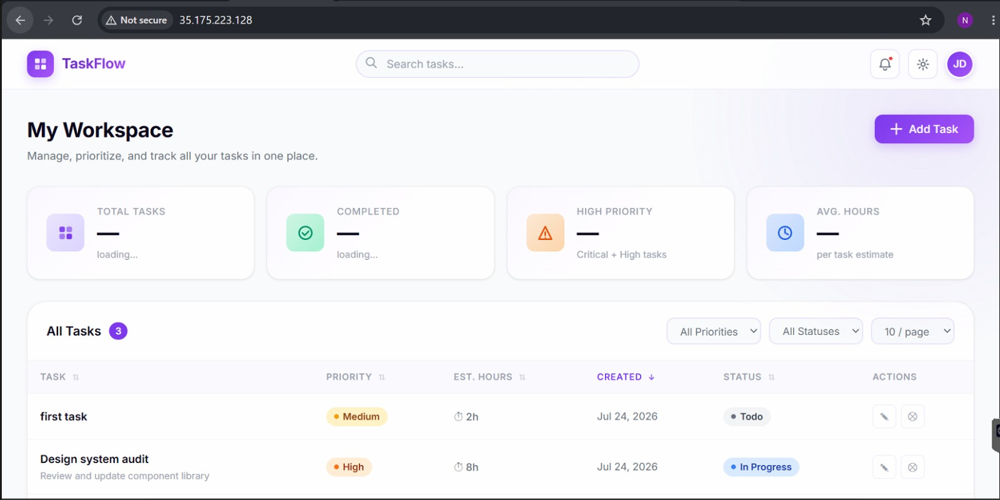
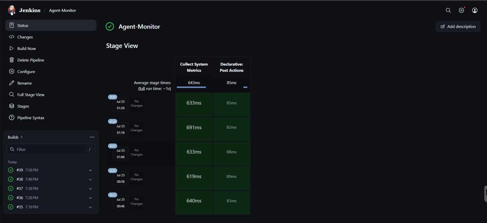

# 🚀 TaskFlow - 3 Tier Application with Complete CI/CD Pipeline

A production-ready 3-tier Task Management application built with **Node.js, Express, MongoDB, Docker, Nginx, Jenkins, SonarQube, Docker Hub, and GitHub Webhooks**.

The project demonstrates an end-to-end DevOps workflow where every code push automatically triggers a CI pipeline, performs static code analysis using SonarQube, builds Docker images, pushes them to Docker Hub, and deploys the latest application through a dedicated CD pipeline.

---

# 📌 Project Overview

This project implements an automated CI/CD pipeline using Jenkins.

---

# 🏗 Architecture



---

# 🔄 CI/CD Pipeline

## GitHub Webhook

Every push to the **main** branch automatically triggers the Jenkins CI pipeline.


---

## CI Pipeline

The CI pipeline performs:

- Checkout Source Code
- Verify Build Environment
- SonarQube Static Code Analysis
- Build Frontend Docker Image
- Build Backend Docker Image
- Login to Docker Hub
- Push Docker Images
- Trigger CD Pipeline



---

## SonarQube Analysis

The project integrates SonarQube for Static Code Analysis.

Checks include:

- Bugs
- Vulnerabilities
- Code Smells
- Security Hotspots
- Maintainability
- Quality Gate



---

## Docker Hub

Successfully built images are pushed automatically.

Images:

- taskflow-frontend
- taskflow-backend



---

## CD Pipeline

The CD pipeline automatically deploys the latest Docker images.

Stages:

- Checkout Deployment Repository
- Verify Environment
- Login Docker Hub
- Stop Existing Containers
- Pull Latest Images
- Deploy Application
- Verify Deployment



---

# ⚙ Deployment Architecture

Deployment is performed using Docker Compose.

Containers

- Nginx
- Frontend
- Backend
- MongoDB

```
Internet
      │
      ▼
 Nginx
      │
 ┌────┴────┐
 │         │
Frontend Backend
           │
       MongoDB
```

---

# 📂 Project Structure

```text
nodejs-3tier/
│
├── backend/
├── frontend/
├── nginx/
├── docker-compose.yml
├── Jenkinsfile
├── sonar-project.properties
└── README.md
```

---

# 🖥 Website Dashboard

The deployed TaskFlow application.



---

# 🐳 Docker Images

The CI pipeline builds

- Frontend Image
- Backend Image

before pushing to Docker Hub.

---

# ⏰ Monitoring Job

A Jenkins cron job collects CPU, Memory and Docker statistics from the deployment server at scheduled intervals.



---

# 🔌 REST APIs

## Tasks

| Method | Endpoint |
|---------|-----------|
| GET | /api/tasks |
| GET | /api/tasks/:id |
| POST | /api/tasks |
| PUT | /api/tasks/:id |
| DELETE | /api/tasks/:id |

---

# 🛠 Technologies Used

## Frontend

- HTML
- CSS
- JavaScript
- Nginx

## Backend

- Node.js
- Express

## Database

- MongoDB

## DevOps

- Jenkins
- GitHub
- GitHub Webhooks
- SonarQube
- Docker
- Docker Compose
- Docker Hub

---

# ✨ Features

- Automated CI Pipeline
- Automated CD Pipeline
- GitHub Webhook Integration
- SonarQube Static Code Analysis
- Docker Image Build & Push
- Docker Compose Deployment
- Zero Manual Deployment
- Docker Hub Integration
- Health Verification
- Scheduled Monitoring Pipeline

---

# 👨‍💻 Author

**Nafiya**

DevOps | Docker | Jenkins | SonarQube | GitHub Actions | CI/CD | AWS